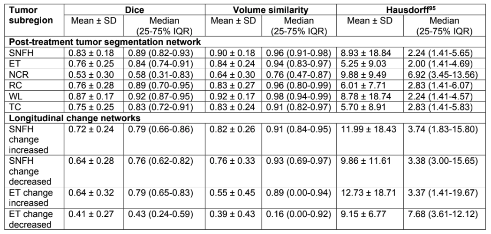

# UCSF-LPTDG-benchmarks
The official nnUNet benchmarks for The University of California San Francisco Longitudinal Post-Treatment Diffuse Glioma (UCSF-LPTDG) dataset.

## Requirements - 

Please install [nnUNetV1](https://github.com/MIC-DKFZ/nnUNet/tree/nnunetv1) in developer mode.

## Code - 

Please look at the notebooks folder to conduct your own experminets using nnUNetv1. Using that code you can also reproduce the same model files that we are sharing in this paper. The notebook helps to perform standard nnUNetv1 experiments on the dataset.

## Pre-trained Models -

All important models are available [here](https://drive.google.com/file/d/1SSnABQkQ-77O_M7qpIKpiSVv2VCxr6oN) for download. 

These are nnUNetv1 models that have been exported to zip files using the `nnUNet_export_model_to_zip` command. To use them, all you have run is `nnUNet_install_pretrained_model_from_zip`, and you will be able to run any of the models. 

We provide the baseline model for Post-treatment Glioma Segmentation.

We also provide 2 skull stripping models for FLAIR and T1Post skullstripping respectively. 

Following are the performance metrics for all the experiments performed in this project. 

## Usage - 

Data and models cannot be used for commerical use. 
